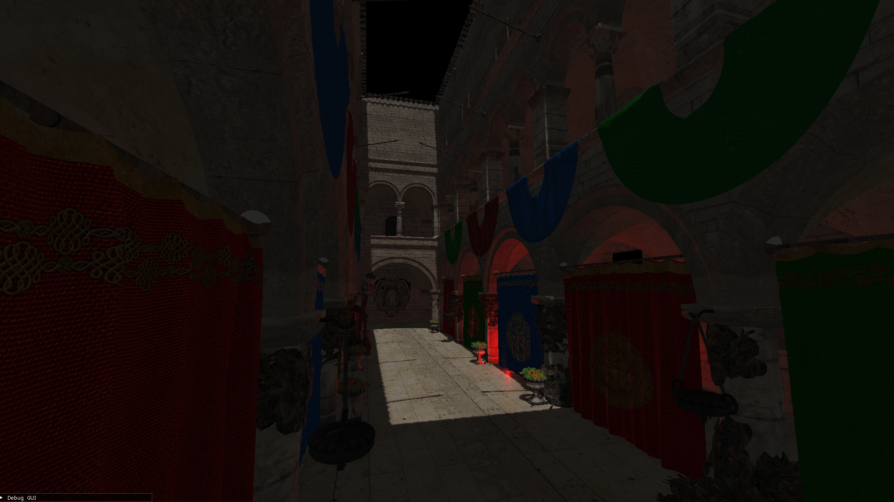

# RigelRenderer
An OpenGL renderer written in C++

## Features
- Blinn-Phong lighting
- Deferred rendering
- Light volume culling 
- Shadow mapping for directional and spot lights
- Model loading with assimp
- Input processing
- Debug GUI drawing with Dear ImGui

## License
[MIT](https://choosealicense.com/licenses/mit/)
